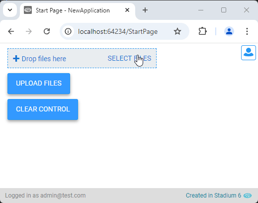

# Clear UploadFile Control Files <!-- omit in toc -->

There is no way to clear uploaded files from a *UploadFile* control programatically. The script below allows you to accompish this in a script or event handler. 



# Version
Initial 1.0

1.1 Added a check for the uniqueness of the assigned classname on the page

# Setup

## Application Setup
1. Check the *Enable Style Sheet* checkbox in the application properties

## Global Script
1. Create a Global Script called "ClearUploadFileControl"
2. Add the input parameters below to the Global Script
   1. UploadFileControlClass
3. Drag a *JavaScript* action into the script
4. Add the Javascript below into the JavaScript code property
```javascript
/* Stadium Script v1.1 https://github.com/stadium-software/utils-clear-upload-file-control */
let scope = this;
let uploadFileControlClass = ~.Parameters.Input.UploadFileControlClass;
let control = document.querySelectorAll("." + uploadFileControlClass);
if (control.length > 1) {
    console.error("The classname '" + uploadFileControlClass + "' is assigned to multiple controls on this page");
    return false;
} else if (control.length == 0) {
    console.error("The classname '" + uploadFileControlClass + "' is not assigned to any control on this page");
    return false;
}
control = control[0];
let getObjectName = (obj) => {
    let objname = obj.id.replace("-container", "");
    do {
        let arrNameParts = objname.split(/_(.*)/s);
        objname = arrNameParts[1];
    } while ((objname.match(/_/g) || []).length > 0 && !scope[`${objname}Classes`]);
    return objname;
};
setDMValues(control, "Files", []);
let containers = control.querySelectorAll(".single-file-upload-container");
for (let i = 0; i < containers.length; i++) {
    containers[i].remove();
}
function setDMValues(ob, property, value) {
    let obname = getObjectName(ob);
    scope[`${obname}${property}`] = value;
}
```

## Page
1. Add a unique class to the *UploadFile* control (e.g. upload-files)

## Event Handler or Script
1. Drag the "ClearUploadFileControl" script into the event hanlder or script where you want to clear the control
2. Add the unique class you added to the control above as the input parameter to the script (e.g. upload-files)

## Working with Stadium Repos
Stadium Repos are not static. They change as additional features are added and bugs are fixed. Using the right method to work with Stadium Repos allows for upgrading them in a controlled manner. How to use and update application repos is described here 

[Working with Stadium Repos](https://github.com/stadium-software/samples-upgrading)